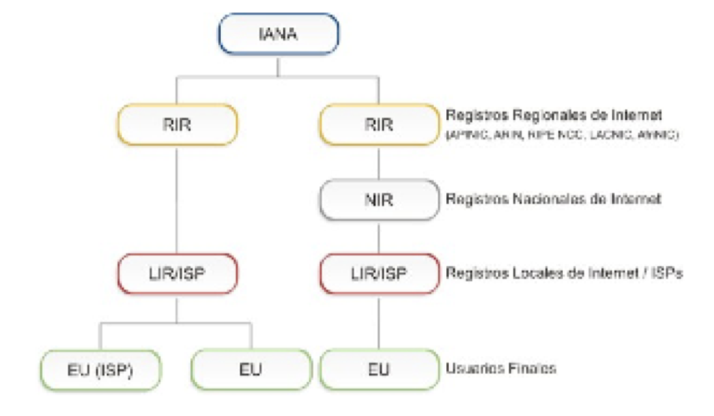

# 1. DEFINICIONES 

Los siguientes términos y sus definiciones son de gran importancia para la comprensión de los objetivos, contextos y políticas descritas en este documento. La distribución de espacio de los recursos de numeración sigue un esquema jerárquico. La responsabilidad de la administración del espacio de direcciones de IP está distribuida globalmente de acuerdo con la estructura jerárquica que se muestra debajo 

## 1.1. IANA (Internet Assigned Number Authority) 

IANA es responsable de distribuir parte del espacio global de las direcciones IP y los números de sistemas autónomos a Registros Regionales de acuerdo a necesidades establecidas. 

## 1.2. Registro de Internet (IR) 

Un Registro de Internet (IR) es una organización responsable de la distribución de espacios de direcciones IP a sus miembros o clientes y del registro de esa distribución. Los IRs están clasificados de acuerdo a su función principal y alcance territorial dentro de la estructura jerárquica delineada en la figura de arriba. 

## 1.3. Registro de Internet Regional (RIR) 

Los Registros de Internet Regionales (RIRs) son establecidos y autorizados por las comunidades regionales respectivas, y reconocidos por el IANA para servir y representar grandes regiones geográficas. El rol principal de los RIRs es administrar y distribuir los recursos de Internet dentro de las respectivas regiones. 

## 1.4. Registro de Internet Nacional (NIR) 

Un Registro de Internet Nacional (NIR) distribuye, principalmente, los recursos de Internet a sus miembros o constituyentes, los cuales generalmente son LIRs. 

## 1.5. Registro de Internet Local (LIR) 

Registro de Internet Local (LIR) es un IR que a su vez asigna recursos de Internet a usuarios de los servicios de red que éste provee. Los LIRs son generalmente ISPs, cuyos clientes son principalmente usuarios finales y posiblemente otros ISPs. 

## 1.6. Proveedor de Servicios de Internet (ISP) 

Un Proveedor de Servicios de Internet asigna principalmente espacio de direcciones IP a los usuarios finales de los servicios de red que éste provee. Sus clientes pueden ser otros ISPs. Los ISPs no tienen restricciones geográficas como lo tienen los NIRs. 

## 1.7. Sitio Final o Usuario Final (EU) 

Un end site es definido como un usuario final (suscriptor) que tiene una relación de negocios o legal (misma o entidades asociadas) con un proveedor de servicios Internet que involucra:

- al proveedor de servicios asignando un espacio de direcciones al usuario final 
- al proveedor de servicios otorgando un servicio de tránsito para el usuario final hacia otros sitios.
- al proveedor de servicios transportando el tráfico del usuario final 
- al proveedor de servicios anunciando un prefijo de ruta agregado que contiene el rango asignado por LACNIC al usuario final 

## 1.8. Distribuir

Distribuir significa delegar el espacio de direcciones a los IRs con el propósito de que ellos realicen la subsiguiente distribución. 

## 1.9. Asignar 

Asignar significa delegar espacio de direcciones a un usuario final, para su uso exclusivamente dentro de la infraestructura que opera, a , así como para fines de interconexión. 

La asignación de espacio de direcciones es sólo para el uso por el receptor original de dicha asignación, así como para dispositivos de terceros, siempre y cuando estén operando dentro de dicha infraestructura. 

No está permitida, por tanto, la subasignación a terceros, fuera de dicha infraestructura (por ejemplo, el uso de asignaciones de usuario final para clientes de un ISP o similares), ni proporcionar direccionamiento a terceros en data-centers (y similares). 

## 1.10. El sistema de registro de Internet

El sistema de registro de Internet ha sido establecido con la finalidad de hacer cumplir los objetivos de exclusividad, conservación, ruteabilidad e información. Este sistema consiste de Registros de Internet (IR) organizados jerárquicamente. Los recursos numéricos de Internet (direcciones, ASNs, otros) son típicamente asignados a los usuarios finales por los ISPs o los NIRs.

Por otra parte, estos recursos son previamente distribuidos a los NIRs e ISPs por parte de los Registros Regionales de Internet. 

Bajo este sistema los usuarios finales son aquellas organizaciones que operan redes en donde se utilizan los recursos. Los NIRs al igual que LACNIC mantienen recursos para ser asignados a usuarios finales o distribuidos a Proveedores de Servicios de Internet. Los recursos asignados son utilizados para la operación de redes, mientras que los recursos distribuidos se mantienen en los Registros de Internet para futuras asignaciones a sus usuarios finales. 

Se recuerda que los recursos distribuidos o asignados por LACNIC o los NIRs, lo son a título exclusivo para el uso por parte del receptor de los mismos, o con la autorización de éste, por parte de terceros, siempre y cuando lo permitan las políticas vigentes. Se recomienda que dichas autorizaciones puedan ser verificadas por medio de RPKI. 

## 1.11. Ruteabilidad no garantizada 

Ni LACNIC, ni los NIR garantizan la ruteabilidad de las direcciones distribuidas o asignadas. 

Los receptores de recursos son responsables de negociar dicha ruteabilidad con sus proveedores de conectividad. LACNIC proveerá en los casos en los que sea necesario, la orientación correspondiente. 

Sin embargo, los recursos distribuidos o asignados deben ser anunciados en un plazo máximo de 90 días, salvo en aquellos casos en que se justifique la necesidad de no hacerlo. 

Los RIRs deben aplicar procedimientos operativos que reduzcan la posibilidad de fragmentación del espacio de direcciones, para minimizar riesgos de pérdida de ruteabilidad. 

## 1.12. Multiproveedor 

Un sitio es multiproveedor si recibe conectividad de tiempo completo de más de un proveedor de servicios de Internet y tiene uno o más prefijos de ruteo anunciados por al menos dos de sus proveedores de conectividad. Se entiende como proveedores independientes a el hecho de que uno no utilice al otro para alcanzar Internet. 

## 1.13. ROAs RPKI con ASN 0 

LACNIC creará autorizaciones de origen (ROAs) específicas en la infraestructura de RPKI con AS 0 en el campo Origin ASN y la lista de recursos numéricos de Internet no distribuidos o no asignados exclusivamente bajo la administración de LACNIC en la lista de prefijos de tales ROAs. 

El número de los ROA antes mencionados y cualquier otro parámetro técnico quedará a discreción de LACNIC. 

Solo LACNIC tendría la autoridad para crear ROAs RPKI para los recursos numéricos de Internet aún no distribuidos ni asignados o bien para los recursos recuperados o devueltos, de los cuales LACNIC es el custodio legítimo. 

Una vez que un recurso numérico de Internet se distribuya o asigne, LACNIC invalidará los ROAs que contengan dicho recurso y emitirá otros nuevos donde el recurso no aparezca, según sea necesario. 

## 1.14. Principios para una buena administración/custodia 

El principio fundamental es la distribución de recursos de numeración de Internet únicos de acuerdo con las necesidades técnicas y operativas de las redes que hacen o harán uso de dichos recursos de numeración. Permitiendo el crecimiento y la sostenibilidad de Internet. 

Los recursos de numeración de Internet bajo la custodia de LACNIC se deben distribuir a organizaciones legalmente establecidas en su región de servicio y para atender mayoritariamente* redes y servicios que operan en dicha región. Se permite que clientes externos se conecten directamente a una infraestructura principal ubicada dentro de la región. 

Se entiende mayoritariamente como más del 50%. 

Los servicios de anycast con utilización de recursos fuera de la región son aceptables siempre que sean prestados por una organización legalmente establecida en la región de servicio y que al menos una copia del servicio se mantenga en infraestructura local. 
Al obtener cualquier tipo de recursos de LACNIC o el NIR correspondiente, en caso de tener recursos legados, estos dejan de ser considerados legados. 

### 1.14.1. Distribución racional 

Los recursos de numeración de Internet se deben distribuir garantizando su unicidad y teniendo en cuenta las necesidades técnicas operativas de las redes e infraestructuras que harán uso de los mismos.

Se deben tener en cuenta ciertas consideraciones en cuanto a las posibles limitaciones de los espacios disponibles para cada recurso de numeración en el momento de la distribución. 

### 1.14.2. Registro público de datos 

Proveer un registro público de datos relacionados con los recursos de numeración de Internet es un requisito fundamental del sistema de distribución de recursos de numeración de Internet.

Con el objeto fundamental de garantizar la unicidad y proveer información sobre el uso y datos de contacto en caso de problemas operativos o de seguridad. También para estudios sobre utilización de estos recursos. 

### 1.14.3. Distribución jerárquica 

La distribución de recursos de numeración de Internet en forma jerárquica contribuye a la escalabilidad del sistema de enrutamiento de las direcciones de Internet, permitiendo que las direcciones sean agrupadas y anunciadas de la manera más resumida posible. 

Los objetivos arriba mencionados pueden, en algunos casos, estar en conflicto entre sí o con los intereses particulares de las organizaciones solicitantes. En estos casos es necesario analizar cuidadosamente cada situación particular de manera de poder alcanzar un compromiso adecuado entre las diferentes partes involucradas en el conflicto. 

## 1.15. Solicitud de recursos 

Las solicitudes de recursos a LACNIC o los NIRs correspondientes, se realizarán con los sistemas en vigor. 

Cualquier solicitud que sea considerada incompleta, será regresada al solicitante con las debidas indicaciones, para poder ser completada.